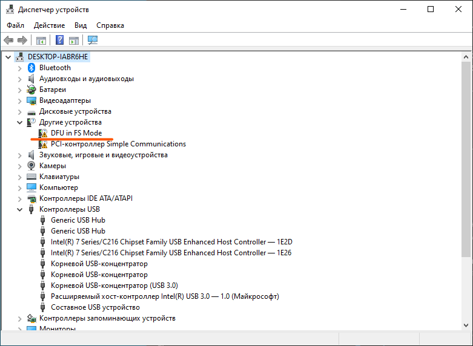
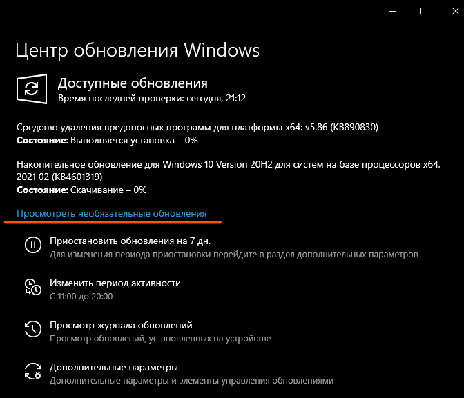
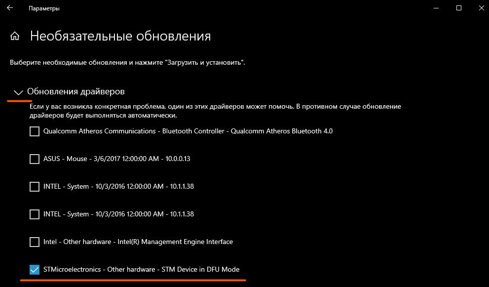

## Скачивание свежей прошивки

Кликните на картинку, чтобы скачать свежую сборку полной прошивки:
[{: width="400"}](https://update.flipperzero.one/master/full.dfu)

## Вход в режим DFU

DFU означает Device Firmware Update.

{{ gif("../../assets/how-to-dfu.mp4") }}

Чтобы войти в режим DFU:

1. Нажмите и удержите :flp-btn-left: + :flp-btn-back: как при перезагрузке, подождите секунду
2. Отпустите :flp-btn-back:, но продолжайте держать :flp-btn-left: ещё на секунду
3. Отпустите :flp-btn-left:

Дисплей погаснет, а светодиод загорится синим, что означает успешный вход в режим DFU.

Подключите ваш Flipper Zero к компьютеру с помощью USB-кабеля.

## Прошивка в Windows

### Установка драйвера

Этот шаг не нужно выполнять каждый раз.

В диспетчере устройств Flipper Zero отображается как `DFU in FS Mode`, и для него необходимо установить драйвер.



Перейдите в Центр обновления Windows -> Посмотреть необязательные обновления.



Найдите пункт `STMicroelectronics`, отметьте галочкой и нажмите `Загрузить`.



После загрузки и установки драйвера название в диспетчере устройств изменится на `STM Device in DFU Mode`.
Иногда может потребоваться перезагрузка ПК.


### Установка DfuSeDemo

Этот шаг не нужно выполнять каждый раз.

Для прошивки Flipper Zero в Windows необходима утилита [DfuSeDemo](https://www.st.com/en/development-tools/stsw-stm32080.html).

Кликните по ссылке, скачайте бесплатную утилиту и установите.

Сайт попросит вас зарегистрироваться для скачивания, это нормально.

### Прошивка

Запустите DfuSeDemo и выберите `STM Device in DFU Mode` в верхней части окна.

В таблице выберите раздел `00  Internal Flash  256 sectors…`.

Нажмите `Choose` в нижней части окна и выберите скачанный на первом шаге файл прошивки.


Нажимаем `Upgrade`, а во всплывающем окне выберите `Да`.


После успешной прошивки] [перезагрузите](rebooting.md) Flipper Zero.

## Прошивка в macOS/Linux

### Установка dfu-util

Сейчас для прошивки Flipper Zero через USB-C порт необходима утилита `dfu-util`.

Вы можете пропустить эту часть, если у вас `dfu-util` уже установлен.

=== "macOS"
    Установите [Homebrew](https://brew.sh), если у вас его нет:
    ``` sh
    /bin/bash -c "$(curl -fsSL https://raw.githubusercontent.com/Homebrew/install/HEAD/install.sh)"
    ```

    Установите `dfu-util`:
    ``` sh
    brew install dfu-util
    ```
=== "Ubuntu/Debian"
    ``` sh
    sudo apt-get install dfu-util
    ```
=== "Fedora"
    ``` sh
    sudo yum install dfu-util
    ```
=== "Arch"
    ``` sh
    sudo pacman -Sy dfu-util
    ```
=== "Из исходников"
    dfu-util всегда можно [собрать из исходников](http://dfu-util.sourceforge.net/build.html).

### Прошивка

Запустите эту команду в терминале, чтобы загрузить прошивку на устройство:
``` sh
dfu-util -a 0 -D full.dfu
```

После установки прошивки [перезагрузитесь](rebooting.md), чтобы выйти из режима DFU.

USB-кабель можно вытаскивать как до перезагрузки, так и после.
